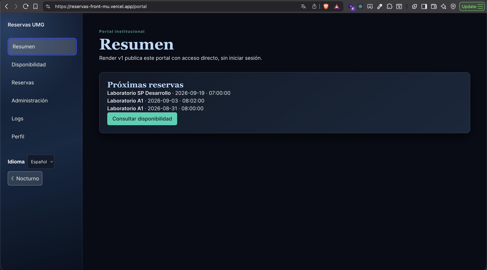
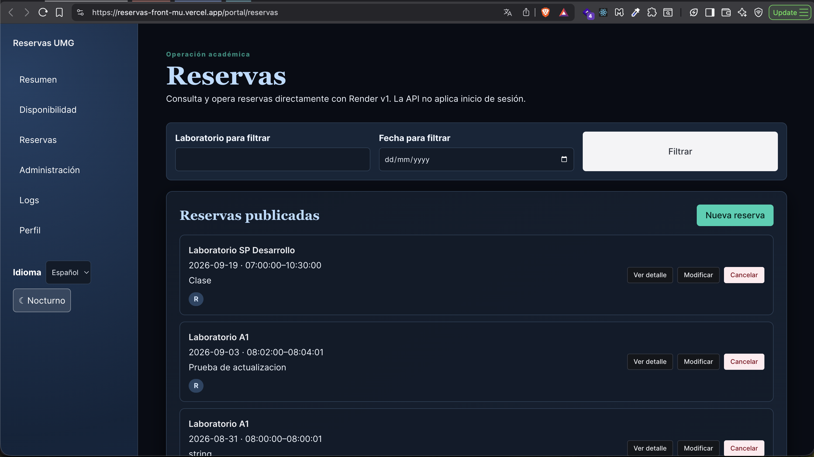
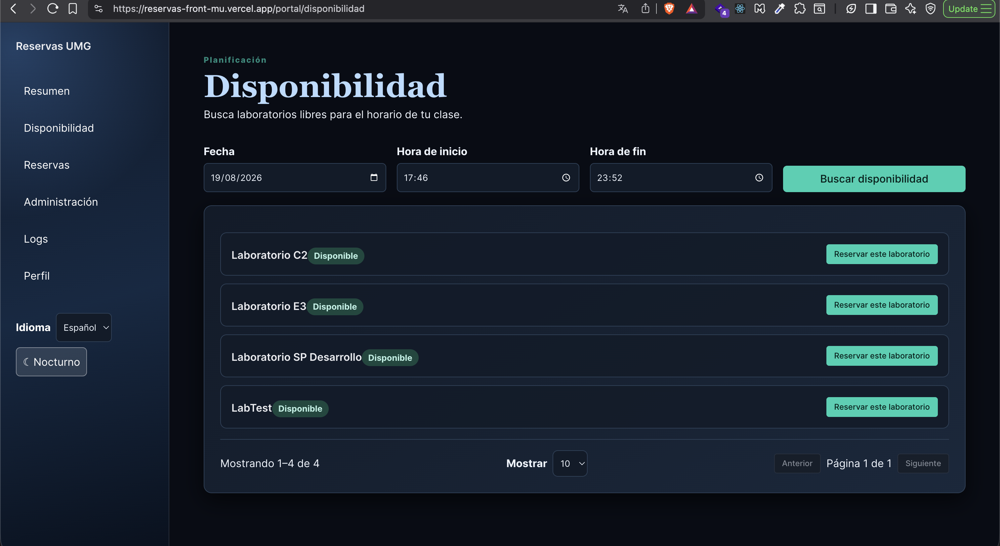
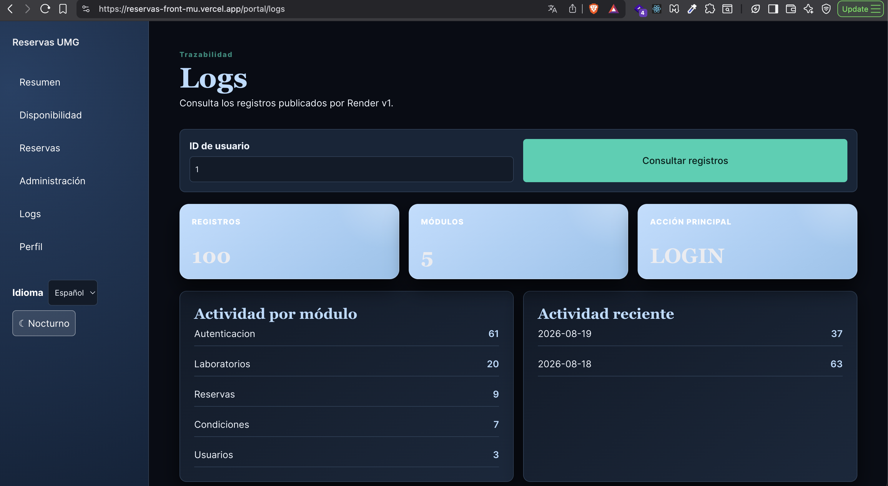

# Reservas Front

This repository is intentionally reset to a documentation-first baseline so the web application can be rebuilt from scratch using spec-driven development and trunk-based delivery.

## Current baseline state

Only governance and specification assets are kept at root level:

- `README.md`
- `SECURITY.md`
- `AGENTS.md`
- `docs/`
- `specs/`

Implementation code, build files, and runtime folders will be recreated in controlled phases.

## Source of truth

- Primary API docs: https://umg-api-django.onrender.com/api/docs/
- Local Render v1 contract baseline: `specs/api-contract.json`
- API contract snapshot: `specs/contracts/render-v1-openapi.yaml`
- Product behavior: `specs/product-design.md`
- Acceptance scenarios: `specs/acceptance/HU-018-web-client.feature`
- Constraints traceability: `specs/constraints-traceability.md`
- i18n and error specification: `specs/i18n-error-spec.md`
- Team workflow rules: `AGENTS.md` + `docs/`

## Technical baseline

- Framework: Next.js (App Router)
- UI runtime: React
- Language: JavaScript
- CSS framework: Bulma
- Container runtime target: Podman
- Free hosting target: Vercel (sole target)

This project is not a pure React-only baseline.

## How the project works

The target flow is:

1. User interacts with web UI routes (`/`, `/acceso`, `/portal/...`).
2. UI layer calls application/client services.
3. Client services map requests only to published Render v1 contract operations.
4. API requests go to the Django API source through the configured base URL.
5. Responses are normalized for UI state rendering.

Architecture and sequence diagrams are documented in `docs/architecture-flow.md`.

## Frontend routes

| Route | Access | Purpose |
|---|---|---|
| `/` | Public | Institutional landing page, laboratory overview, reservation process, FAQ, language selector, and access call to action. |
| `/acceso` | Public | Required login form using only `POST /api/auth/login/`; there is no public registration or password-recovery flow. |
| `/portal` | Authenticated UI | Operational summary and navigation for the signed-in identity. |
| `/portal/perfil` | Authenticated UI | Shows the active session identity and changes only that user’s password through the published operation. |
| `/portal/disponibilidad` | Authenticated UI | Laboratory availability search for a selected date and interval. |
| `/portal/reservas` | Authenticated UI | Paginated reservation list plus modal detail; administrators can manage future reservations and professors only their own. |
| `/portal/administracion` | Authenticated UI | Laboratories, laboratory conditions, and audit review; administrators can manage the published laboratory and condition operations. |
| `/portal/usuarios` | Administrator UI | Dedicated user-management route: real Render users, create, password reset, and inactivate actions. It is absent for professors, who are redirected if they open it directly. |
| `/portal/logs` | Authenticated UI | Audit dashboard and paginated Render v1 log view, initially loaded for the signed-in user ID. It groups returned records locally by default calendar week or an explicit date range; administrators also see project-resource indicators from published labs, conditions, reservations, and users. |
| `/_not-found` | Public | Framework-generated fallback for unmatched routes. |

The client includes localized ES/EN interface copy, accessible loading states,
route-level lazy loading, 10/20/50 client-side pagination, accessible dialogs and
a persisted premium light/dark theme. Database values and URLs remain unchanged
when the language changes.

### Audit logs and dashboard

The live Render endpoint requires the published `UMG_User_ID` query parameter even
though the captured schema marks it optional. The Logs route starts from the
signed-in ID and retains an editable query. Its full-width weekly chart defaults to
the Monday-to-Sunday interval containing the newest returned record; users may also
apply a validated local date range. Cards, chart, module bars and pagination are
calculated only from records returned by Render; no mock records, analytics endpoint,
or undocumented date query is used. For administrators, the operational section
separately derives laboratories, conditions, reservations, and accounts from their
published Render reads. It never displays CPU, memory, pod, uptime, or other server
telemetry because Render v1 does not publish it.

`/acceso` validates credentials with Render and retains only a normalized identity
(ID, name, email and role) in `sessionStorage` for the current browser tab. It never
stores the password, token, cookie, or a secret. The client’s Admin/Professor rules
make the interface usable but are not backend authorization: Render v1 can still
accept anonymous requests.

> **Security TODO (backend):** Render must enforce the authenticated identity and
> per-operation permissions server-side. The UI gate must never be considered a
> substitute for backend authorization.

## Production evidence and live data

The production client is available at
[reservas-front-mu.vercel.app](https://reservas-front-mu.vercel.app/portal).
The screenshots below were captured from that deployment on 19 August 2026.

| Page | Production route | Runtime data source |
|---|---|---|
| Summary | [`/portal`](https://reservas-front-mu.vercel.app/portal) | `GET /api/reservas/` |
| Reservations | [`/portal/reservas`](https://reservas-front-mu.vercel.app/portal/reservas) | `GET /api/reservas/` |
| Availability | [`/portal/disponibilidad`](https://reservas-front-mu.vercel.app/portal/disponibilidad) | `GET /api/labs/disponibles/` |
| Audit logs | [`/portal/logs`](https://reservas-front-mu.vercel.app/portal/logs) | `GET /api/logs/?UMG_User_ID=<value>` |
| User management | [`/portal/usuarios`](https://reservas-front-mu.vercel.app/portal/usuarios) | `GET/POST /api/usuarios/` plus documented administrator PATCH actions |

### Summary

### Reservations

### Availability

### Audit logs

### API verification scope

On 19 August 2026, the following non-mutating Render calls were executed against
production and returned HTTP `200`: users (17 records), laboratories (7),
conditions (8), reservations (69), availability for the documented interval (4),
logs for `UMG_User_ID=1` (100), and the detail for a returned reservation.

Runtime pages do **not** use mock, fixture, sample, or hard-coded API records.
Every displayed database value comes from the corresponding Render response; the
logs dashboard only aggregates those returned records in the browser. Mocked data
exists solely in `*.test.js` files to isolate unit tests.

`POST`, `PUT`, and `PATCH` operations are represented by the verified local Render
v1 contract and exercised through unit tests, but are intentionally not invoked
against production by automated verification because they create or alter real
records. A full live certification of those operations requires an explicitly
approved disposable test account and records.

## API endpoint inventory (Render v1 contract)

| Operation | Method | Path |
|---|---|---|
| login | POST | /api/auth/login/ |
| changePassword | POST | /api/auth/cambiar-contrasena/ |
| listUsers | GET | /api/usuarios/ |
| createUser | POST | /api/usuarios/ |
| deactivateUser | PATCH | /api/usuarios/{id}/inactivar/ |
| resetUserPassword | PATCH | /api/usuarios/{id}/resetear-contrasena/ |
| listLabs | GET | /api/labs/ |
| createLab | POST | /api/labs/ |
| updateLab | PUT | /api/labs/{id}/ |
| getLabAvailability | GET | /api/labs/disponibles/ |
| listLabConditions | GET | /api/condiciones/ |
| createLabCondition | POST | /api/condiciones/ |
| updateLabCondition | PUT | /api/condiciones/{id}/ |
| listReservations | GET | /api/reservas/ |
| createReservation | POST | /api/reservas/ |
| getReservation | GET | /api/reservas/{id}/ |
| updateReservation | PUT | /api/reservas/{id}/modificar/ |
| cancelReservation | PATCH | /api/reservas/{id}/cancelar/ |
| listAuditLogs | GET | /api/logs/?UMG_User_ID={userId} |

## Trunk-based workflow

- `main` must stay stable and releasable.
- Branches are short-lived (`feature/*`, `fix/*`).
- Merge in small batches with fast feedback.
- Delete branches after merge.

Branch examples:

- `feature/login`
- `feature/backend-connectivity`
- `fix/get-main-dashboard-info`

Commit style:

- Short native English messages.
- Example: `add login shell`

## Quality gates policy

Minimum required before merging into `main`:

- Contract validation.
- Static checks/lint.
- Unit tests.
- Jest coverage > 80%.
- Friendly localized error behavior validated for critical user journeys.

Note: command scripts are reintroduced during scaffold phase. The execution policy is defined now; runnable scripts are part of implementation tasks.

## Podman container plan

Containerized development is an explicit requirement.

- Runtime: Podman
- Orchestration: Podman Compose (`podman compose`)
- Planned services:
	- `web` (Next.js app)
	- optional local `mock-api` for isolated testing

Detailed container spec and runbook:

- `specs/containerization-spec.md`
- `docs/podman-runbook.md`

## Free hosting plan (Vercel-first)

The frontend must be deployable to Vercel as its only hosting target.

Deployment expectations:

- Production build must be compatible with Vercel build/runtime constraints.
- All environment variables must be managed in hosting settings (never committed).
- Preview deployments must be enabled per branch/PR.
- API base URL must be configurable per environment (preview/production).

Required documentation:

- `docs/deployment-free-hosting.md`
- `specs/deployment-hosting-spec.md`

Readiness gate before first production publish:

1. Contract, lint, and tests are green.
2. Jest coverage remains above 80%.
3. Security policy checks for secrets and headers are satisfied.
4. Vercel Preview and Production deployments both succeed.

## Start here

1. Read `docs/construction-kickoff.md`.
2. Review `todo-list.md`.
3. Review `stack.md`.
4. Implement in short feature branches following `AGENTS.md`.
