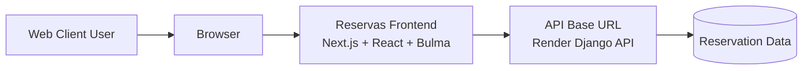
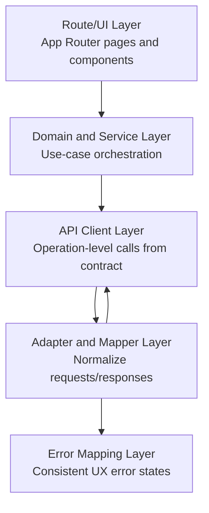
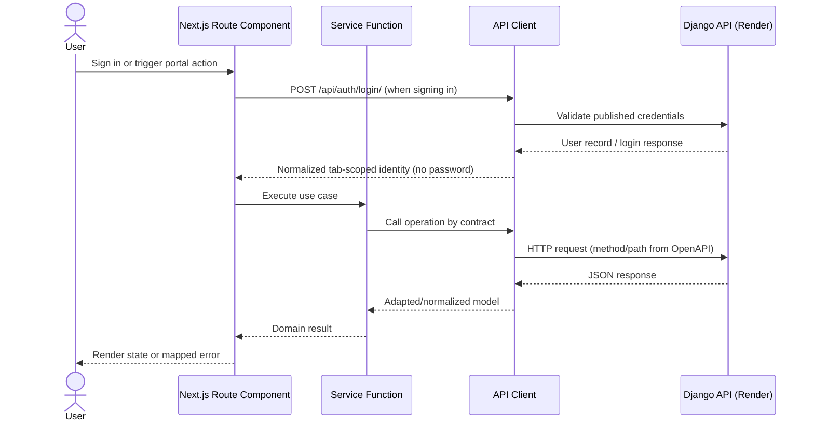
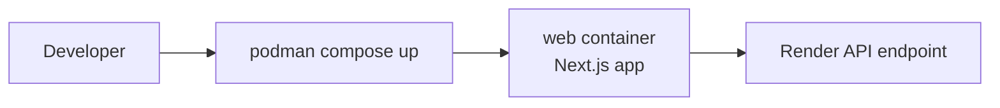

# Architecture Flow

## System context

## Logical layers

## Request sequence

`/acceso` primero valida con Render v1 y preserva solo metadatos de identidad en
`sessionStorage` para la pestaña actual. Luego las rutas del portal llaman Render v1
directamente y omiten credenciales del navegador. El rol local controla la UI, pero
no reemplaza autorización backend porque el contrato publicado aún permite acceso
anónimo.

La ruta de logs usa exclusivamente `GET /api/logs/?UMG_User_ID=<value>`. La
segmentación semanal y por rango ocurre en el navegador sobre esa respuesta; no se
envía ningún parámetro de fecha, analítica o paginación que Render v1 no publique.
Para administradores, los paneles operativos leen por separado los laboratorios,
condiciones, reservas y usuarios publicados. Esos conteos son de la operación
académica; el cliente no solicita ni simula telemetría de infraestructura.

## Deployment flow with Podman

