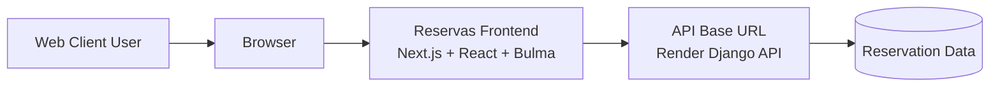
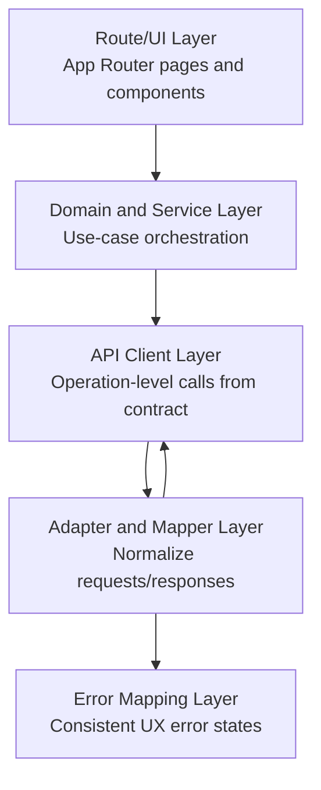
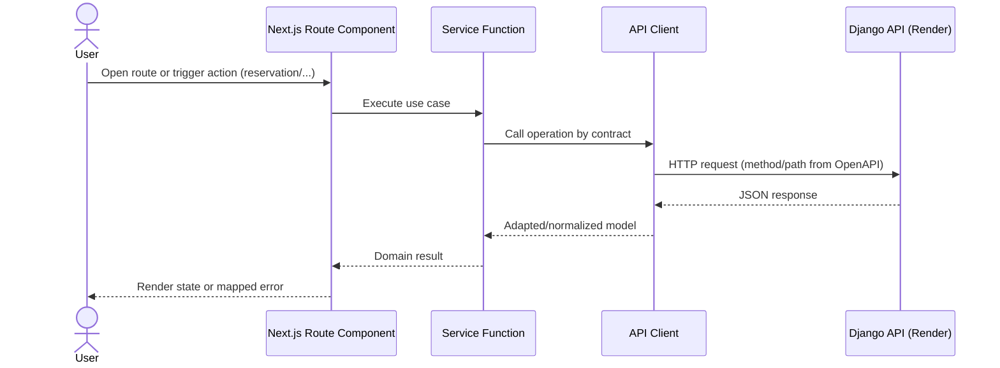
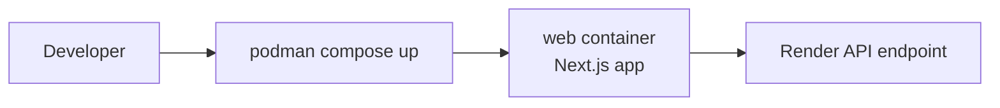

# Architecture Flow

## System context

## Logical layers

## Request sequence

Portal routes call Render v1 directly; login is an optional diagnostic operation,
not a prerequisite or client-side authorization boundary. Requests omit browser
credentials because the published contract permits anonymous access.

## Deployment flow with Podman

